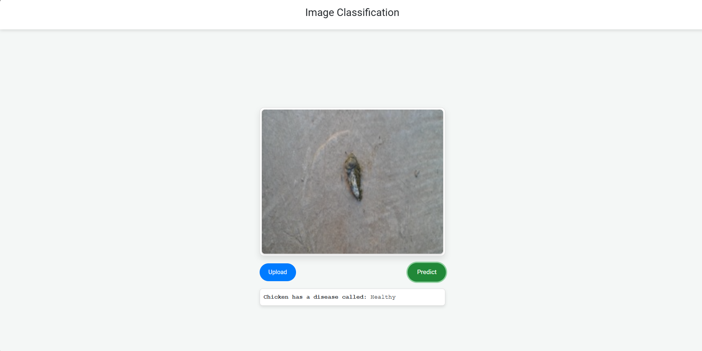
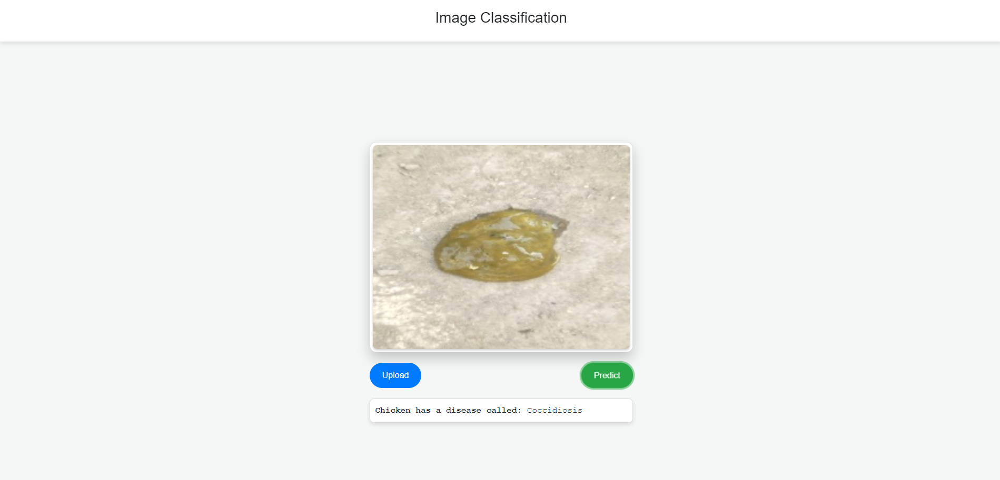

# Chicken Disease Classification


## Problem Statement

To detect diseases in chickens at an early stage using deep learning techniques, preventing mortality in chickens, farmers loss due to mortality among chickens and ultimately keeping us healthy too. The aim of this project is to develop a very intelligent system for the early identification of various diseases in chickens. VGG16 from Keras Applications was implemented for the categorical classification of "Coccidiosis" and "Healthy.”

## Test Results

<div> 
 <iframe width="560" height="315" src="./asset/chickenvideo.webm" frameborder="0" allow="accelerometer; autoplay; clipboard-write; encrypted-media; gyroscope; picture-in-picture" allowfullscreen></iframe>
</div>
 
<p >
    
    
</p>


## WorkFlow

1 Update config.yaml

2 Update secret.yaml

3 Update params.yaml

4 Update the entity

5 Update the configuration manager in src config

6 Update the components

7 Update the pipeline

8 Update the main.py

9 Update the dvc.yaml

## How to run the project

### STEP:
###    Clone the repository

```bash
https://github.com/Shubhankargupta691/Chicken_Disease_Classification.git
```

### STEP 01- Create a [conda](https://www.anaconda.com/download/) environment in the Project Folder

```bash
conda create -n chicken_venv python=3.11 -y
```

```bash
conda activate chicken_venv
```

### STEP 02- install the requirements

```bash
pip install -r requirements.txt
```

### STEP 03- run main.py

```bash
python main.py
```

### STEP 04- run app.py

```bash
python app.py
```
### [DVC Commands](https://dvc.org/doc)

#### STEP 01- [Initialize](https://dvc.org/doc/command-reference/init#init)
```bash
dvc init
```

#### STEP 02- [Reproduce complete or partial pipelines](https://dvc.org/doc/command-reference/repro#repro)
```bash
dvc repro
```

#### STEP 03- [Directed Acyclic Graph (DAG)](https://dvc.org/doc/command-reference/dag)
```bash
dvc dag
```

### Relationship between the pipelines:


# AZURE CICD Deployment with Github Actions

## Run these docker command  from terminal:

NOTE:  If you're using Windows and have to download and install Docker Desktop and run it in background.

#### STEP 01: Build the Docker image 

```bash
docker build --no-cache -t imageclassificationapp.azurecr.io/classification:latest .
```
#### STEP 02: Login to an Azure Container Registry (ACR) using Docker
```bash
docker login imageclassificationapp.azurecr.io
```
#### STEP 03: Push the Docker Image to Azure Container Registry (ACR)

```bash
docker push imageclassificationapp.azurecr.io/classification:latest
```

# Setup github secrets:

```bash
AZUREAPPSERVICE_CONTAINERPASSWORD

AZUREAPPSERVICE_CONTAINERUSERNAME

AZUREAPPSERVICE_PUBLISHPROFILE
```

## Deployment Steps:

1. Build the Docker image of the Source Code
2. Push the Docker image to Container Registry
3. Launch the Web App Server in Azure
4. Pull the Docker image from the container registry to Web App server and run

## Docker Image:

```bash
docker pull shubhankargupta/classification:latest
```
